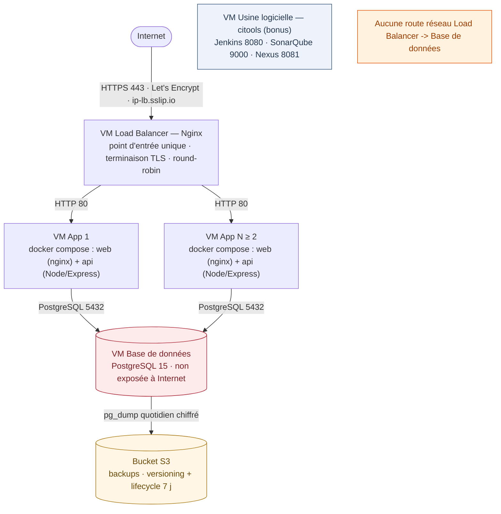

# Shaka Surf — Infrastructure DevOps

Infrastructure **complète, automatisée et reproductible** : **Terraform**
(provisionnement AWS), **Ansible** (configuration par rôles, inventaire généré)
et **Molecule** (un scénario de test par rôle) déploient un **mock de
l'application Shaka Surf** — un petit site de réservation de spots de surf,
versionné dans ce dépôt (`app/`).

> Projet DevOps — EFREI 4e année. Le sujet laisse le **choix des technologies
> applicatives** libre : l'évaluation porte sur l'infrastructure. Nous avons donc
> remplacé l'application réelle par un mock minimal mais réaliste (frontend +
> API + PostgreSQL), ce qui rend tout le pipeline testable de bout en bout.
> Aucune ressource n'est créée manuellement : tout est en code.

---

## Tester en 2 minutes (démo locale, sans AWS)

La démo locale reproduit **1:1 l'architecture AWS** sur votre poste : les
réseaux Docker jouent le rôle des Security Groups, MinIO celui du bucket S3.
Seul prérequis : **Docker Desktop**.

```bash
git clone <url-du-depot> shaka-surf-devops
cd shaka-surf-devops
docker compose up --build -d
```

Puis ouvrir **https://localhost:8443** (certificat auto-signé généré au
démarrage : acceptez l'avertissement du navigateur).

| Ce que vous pouvez tester | Comment | Ce qu'on observe |
|---------------------------|---------|------------------|
| **Round-robin** du load balancer | Bouton « 10 requêtes » dans l'interface | Les réponses alternent entre `app-1` et `app-2` |
| **Persistance** des données | Créer une réservation, recharger la page | La réservation reste (PostgreSQL) |
| **Panne de la base** | `docker compose stop db` (puis `docker compose start db`) | Bandeau « mode dégradé » — l'application ne crashe pas |
| **Backup chiffré vers S3** | `docker compose exec backup backup` | Un objet `.sql.gz.enc` apparaît dans le bucket |
| **Console S3 (MinIO)** | http://localhost:9001 — login `demo` / `demodemo123` | Le bucket `shaka-surf-backups` et ses objets datés |
| **Restauration** | `docker compose exec backup restore` | Le dump le plus récent est rejoué dans PostgreSQL |
| **Nettoyage** | `docker compose down -v` | Tout est supprimé (conteneurs + volumes) |

> Les mots de passe (`demo`, `demodemo123`…) sont volontairement évidents :
> **démo locale uniquement**. En production, les secrets passent par Ansible Vault.

Correspondance démo <-> AWS détaillée : [`docs/architecture.md`](docs/architecture.md).

---

## 1. Architecture



Détails (machines, rôles, flux réseau, ports, Security Groups, correspondance
démo locale <-> AWS) : [`docs/architecture.md`](docs/architecture.md).
Conception initiale (document historique, antérieur au mock) : [`docs/specs/`](docs/specs/).

---

## 2. L'application mock

Chaque VM applicative exécute **deux conteneurs** via `docker compose`
(`app/docker-compose.yml`) :

- **`web`** — frontend statique vanilla (HTML/CSS/JS) servi par `nginx:alpine`,
  qui proxifie `/api/` vers l'API (`app/frontend/`) ;
- **`api`** — API Node 20 (Express + pg) sur le port 9940, connectée à la VM
  PostgreSQL (`app/backend/`).

Le schéma et le jeu de données (6 spots de surf français ) sont dans
`app/db/init.sql`, **idempotent** (rejouable sans effet de bord).

| Endpoint | Méthode | Description |
|----------|---------|-------------|
| `/api/whoami` | GET | Nom de l'instance qui répond — rend le round-robin visible |
| `/api/health` | GET | `ok` / `degraded` + état de la base (`db: up/down`) — ne crashe jamais si la DB tombe |
| `/api/spots` | GET | Liste des spots de surf |
| `/api/bookings` | GET / POST | Réservations (avec nom du spot) / création (`201`) |

**Pourquoi un mock ?** Le sujet précise que les technologies applicatives sont
libres : ce qui est évalué, c'est l'infrastructure. Le mock est versionné dans
le dépôt (aucune dépendance externe), tient en quelques fichiers lisibles, et
conserve les propriétés qui rendent l'infra intéressante : état en base
PostgreSQL, plusieurs instances identiques derrière un LB, mode dégradé propre
en cas de panne de la base.

---

## 3. Déploiement AWS de zéro

### Pré-requis (poste de contrôle)

Linux, WSL ou macOS (Ansible ne tourne pas nativement sous Windows) :
Terraform ≥ 1.5, Ansible ≥ 2.15, Molecule + Docker, AWS CLI v2 et une paire de
clés SSH EC2.

Les credentials AWS sont fournis par variables d'environnement (Terraform et
l'AWS CLI les lisent automatiquement) :

```bash
cp .env.example .env          # puis renseigner vos clés IAM
set -a; source .env; set +a   # charge AWS_ACCESS_KEY_ID, AWS_SECRET_ACCESS_KEY, AWS_DEFAULT_REGION

cd ansible
ansible-galaxy collection install -r requirements.yml
```

> Les types d'instances par défaut sont `t3.micro` (éligibles au *free tier*),
> suffisants pour provisionner et valider toute l'infrastructure. Sur un compte
> sans restriction, augmentez `instance_type_citools` (SonarQube/Nexus exigent
> ≥ `t3.medium`) dans `terraform.tfvars`.

### Étape 1 — Provisionner l'infrastructure (Terraform)

```bash
cd terraform
cp terraform.tfvars.example terraform.tfvars
# Éditer terraform.tfvars : ssh_key_name, admin_cidr (votre IP/32), région…

terraform init
terraform plan
terraform apply
```

À la fin, Terraform :
- crée le VPC, les Security Groups, les VMs (LB, ≥2 App, DB, citools), le bucket
  S3 et le rôle IAM ;
- **génère automatiquement** l'inventaire Ansible dans
  `ansible/inventory/hosts.ini` (depuis les outputs).

Récupérer l'URL publique : `terraform output lb_url`.

### Étape 2 — Renseigner les secrets (Ansible Vault, 3 secrets seulement)

```bash
cd ../ansible
cp vault.example.yml group_vars/all/vault.yml
# Renseigner de vraies valeurs :
# vault_postgres_password — mot de passe PostgreSQL de l'application
# vault_postgres_admin_password — mot de passe du superutilisateur postgres
# vault_backup_passphrase — passphrase de chiffrement des backups
ansible-vault encrypt group_vars/all/vault.yml
```

> `vault.yml` est **gitignoré** : il ne doit jamais être committé en clair.
> Le modèle `vault.example.yml` vit volontairement **hors** de `group_vars/all/`
> (dossier auto-chargé par Ansible) : sans `vault.yml`, le déploiement s'arrête
> avec une erreur claire au lieu d'utiliser des placeholders.
> Pensez aussi à personnaliser `letsencrypt_email` dans `group_vars/all/vars.yml`
> (contact ACME pour les certificats Let's Encrypt).

### Étape 3 — Configurer et déployer (Ansible)

```bash
ansible-playbook site.yml --ask-vault-pass
```

L'ordre des plays garantit que la base est prête avant les apps, et que le load
balancer connaît les upstreams applicatifs. Le rôle `app` copie `app/` du dépôt
vers `/opt/shaka-surf` sur chaque VM, rend le `.env`, puis `docker compose up --build`.

### Étape 4 — Vérifier

```bash
curl -I "$(cd ../terraform && terraform output -raw lb_url)"
```

---

## 4. Tests Molecule

Chaque rôle possède un scénario Molecule (driver Docker) qui vérifie que le
service est actif et que les ports attendus répondent.

Depuis un poste avec Docker :

```bash
cd ansible
ansible-galaxy collection install -r requirements.yml

# Un rôle :
cd roles/database && molecule test

# Tous les rôles :
for r in common database app loadbalancer backup jenkins sonarqube nexus; do
  (cd roles/$r && molecule test) || break
done
```

> Note : pour `common`, `database`, `loadbalancer`, `backup` et `jenkins`, le
> service réel est démarré et testé (service actif + ports). Pour `sonarqube`
> et `nexus`, le `verify` teste Nginx actif + port 80 + le `proxy_pass` vers le
> bon port amont (le boot complet des applications en docker-in-docker serait
> trop lourd). Pour `app`, le rôle tourne avec `app_compose_up: false` : le
> `verify` contrôle les fichiers déployés (`.env`, droits 0600, `DB_HOST`) et
> valide la structure du compose (services `web` + `api`) — le boot complet de
> la stack est, lui, couvert par la **démo locale** (§1).

---

## 5. Stratégie de backup

| Paramètre | Valeur | Justification |
|---------------|--------|---------------|
| **Quoi** | `pg_dump` de la base `shakasurf` | Dump logique portable (schéma + données), restaurable sur n'importe quelle instance PostgreSQL 15. |
| **Quand** | Quotidien à 02:00 (cron) | Trafic faible la nuit ; RPO ≤ 24 h, suffisant pour une application de réservation au volume modéré, sans surcoût de stockage/CPU. |
| **Traitement**| gzip + chiffrement AES-256 (openssl, passphrase Vault) | Compression pour réduire le coût S3 ; chiffrement pour la confidentialité au transit et au repos. |
| **Où** | `s3://<bucket>/postgres/shakasurf_AAAA-MM-JJ_HHMMSS.sql.gz.enc` | Bucket dédié, versioning + SSE activés, accès public bloqué. |
| **Rétention** | 7 sauvegardes quotidiennes (lifecycle S3) | Couvre une semaine de récupération ; au-delà, suppression automatique pour maîtriser les coûts. Purge locale immédiate après upload. |
| **Accès S3** | Instance-profile IAM (VM DB) | Aucune clé statique : permissions limitées au préfixe `postgres/` du seul bucket. |

Le script de backup est déployé en `/usr/local/bin/pg_backup.sh` par le rôle
`backup`. La **démo locale embarque exactement le même mécanisme** : le
conteneur `backup` (`demo/backup/`) exécute le même pipeline
`pg_dump | gzip | openssl` vers MinIO, sur le même cron (02:00).

---

## 6. Restauration depuis S3

### En production (playbook indépendant)

Le playbook `restore.yml` est **indépendant** du playbook principal. Il récupère
le **dernier** dump présent dans le bucket, le déchiffre et le restaure sur la VM
base de données.

```bash
cd ansible
ansible-playbook restore.yml --ask-vault-pass
```

Sous le capot, il exécute `/usr/local/bin/pg_restore.sh` qui :
1. liste `s3://<bucket>/postgres/` et sélectionne l'objet le plus récent,
2. le télécharge, le déchiffre (passphrase Vault) et le décompresse,
3. le réinjecte via `psql`.

### En démo locale

```bash
docker compose exec backup backup # déclenche un backup immédiat
docker compose exec backup restore # restaure le dump le plus récent depuis MinIO
```

---

## 7. Sécurité

- **Aucune credential en clair** dans le dépôt. Secrets gérés par **Ansible
  Vault**, réduits à **3 valeurs** : `vault_postgres_password` (utilisateur
  applicatif), `vault_postgres_admin_password` (superutilisateur, jamais
  transmis aux VMs App) et `vault_backup_passphrase` (`vault.yml` chiffré et
  gitignoré ; seul le modèle `ansible/vault.example.yml` est versionné).
- Les mots de passe de la **démo locale** (`demo`…) sont volontairement
  évidents, commentés comme tels, et ne servent qu'en local.
- `.gitignore` exclut `*.tfstate*`, `*.tfvars`, `.env`, `*.pem`/`*.key`,
  l'inventaire généré et `vault.yml`.
- **Security Groups** stricts par rôle ; le load balancer ne peut pas joindre la
  base de données ; la base n'expose jamais son port 5432 à Internet. (La démo
  locale rejoue cette règle : le conteneur `lb` n'est pas sur le réseau `data`.)
- Accès SSH restreint à `admin_cidr` (votre IP en /32 — à régler dans `terraform.tfvars`).
- Accès S3 via **instance-profile IAM** (pas de clé statique).
- Durcissement SSH (root et mots de passe désactivés) + fail2ban via le rôle `common`.

---

## 8. Conformité à la consigne

| # | Exigence du sujet | Où c'est réalisé dans le dépôt |
|---|-------------------|--------------------------------|
| **3.1** | ≥ 2 instances applicatives identiques | `terraform/compute.tf` (`count = var.app_count`) ; validation `app_count >= 2` dans `terraform/variables.tf` |
| 3.1 | Instance base de données dédiée, non exposée | `terraform/compute.tf` (VM `db`) ; `terraform/security.tf` (5432 ouvert au seul SG App, rien depuis Internet) |
| 3.1 | Load balancer | VM Nginx dédiée (`terraform/compute.tf`) configurée par `ansible/roles/loadbalancer` |
| 3.1 | Bucket S3 pour les backups | `terraform/s3.tf` (versioning, SSE, lifecycle 7 j, accès public bloqué) + `terraform/iam.tf` (instance-profile) |
| 3.1 | Règles réseau par type de machine | `terraform/security.tf` : un Security Group par rôle (lb/app/db/citools) |
| 3.1 | Aucune ressource créée manuellement | Tout est dans `terraform/` ; même l'inventaire Ansible est généré (`terraform/templates/inventory.tmpl`) |
| **3.2** | Rôle load balancer (Nginx + HTTPS) | `ansible/roles/loadbalancer` — Let's Encrypt + domaine `sslip.io`, round-robin vers les VMs App |
| 3.2 | Rôle app (backend + frontend sur chaque VM) | `ansible/roles/app` — copie `app/` vers `/opt/shaka-surf`, rend `.env`, `docker compose up --build` (conteneurs `web` + `api`) |
| 3.2 | Rôle base de données, accès restreint | `ansible/roles/database` — PostgreSQL 15, `pg_hba` limité à `db_allowed_cidr`, schéma `app/db/init.sql` appliqué de façon idempotente |
| 3.2 | Rôle backup (fréquence/rétention justifiées, envoi S3 automatique) | `ansible/roles/backup` (cron 02:00, chiffrement, upload S3) ; justification §5 ; bucket provisionné par Terraform et configuré par Ansible |
| 3.2 | Inventaire par groupes généré par Terraform | `ansible/inventory/hosts.ini` rendu depuis `terraform/templates/inventory.tmpl` (groupes `loadbalancer`, `app`, `db`, `citools`) |
| **3.3** | Un scénario Molecule par rôle | `ansible/roles/<rôle>/molecule/default/{molecule,converge,verify}.yml` |
| 3.3 | Vérification service actif + ports | `verify.yml` de chaque scénario ; lancement : `molecule test` (§4) |
| **3.4** | Documentation | `README.md` (déploiement §3, Molecule §4, backup §5, restauration §6) + `docs/architecture.md` |
| **3.5 / 4** | Structure de dépôt lisible | §9 ci-dessous |
| 3.5 / 4 | `.gitignore` adapté | `.gitignore` (tfstate, tfvars, vault.yml, `.env`, clés, inventaire généré) |
| 3.5 / 4 | Aucun secret en clair | Ansible Vault (3 secrets, §7) ; seuls des mots de passe de démo locale évidents sont versionnés |
| **5 (bonus)** | VM usine logicielle isolée | `terraform/compute.tf` (VM citools) + `sg-citools` dans `terraform/security.tf` (isolée du réseau applicatif) |
| 5 (bonus) | Rôles Jenkins / SonarQube / Nexus + Molecule | `ansible/roles/{jenkins,sonarqube,nexus}` avec leurs scénarios `molecule/` |
| 5 (bonus) | Domaines HTTPS dédiés | Un sous-domaine `sslip.io` en HTTPS par outil de l'usine logicielle |
| 5 (bonus) | Restauration indépendante + documentée | `ansible/restore.yml` (playbook autonome) + procédure §6 ; rejouable aussi en démo locale |

---

## 9. Structure du dépôt

```
shaka-surf-devops/
├── README.md
├── .gitignore
├── docker-compose.yml # démo locale complète : lb + app1/app2 + db + MinIO + backup
├── app/ # application mock (versionnée dans le dépôt)
│ ├── backend/ # API Node 20 — Express + pg (Dockerfile)
│ ├── frontend/ # frontend statique vanilla servi par nginx (Dockerfile)
│ ├── db/init.sql # schéma + seed idempotents (6 spots )
│ └── docker-compose.yml # compose PAR VM applicative (utilisé par Ansible)
├── demo/ # briques propres à la démo locale
│ ├── lb/ # nginx + certificat auto-signé (≙ VM Load Balancer)
│ └── backup/ # cron + scripts backup/restore vers MinIO (≙ cron de la VM DB)
├── docs/
│ ├── architecture.md # schéma, rôles, flux réseau, démo <-> AWS
│ └── specs/ # conception détaillée
├── terraform/ # provisionnement AWS (IaC)
│ ├── providers.tf variables.tf outputs.tf
│ ├── network.tf security.tf compute.tf s3.tf iam.tf
│ ├── terraform.tfvars.example
│ └── templates/inventory.tmpl # génère l'inventaire Ansible
└── ansible/
    ├── ansible.cfg requirements.yml
    ├── vault.example.yml # modèle de coffre (hors group_vars : non auto-chargé)
    ├── inventory/hosts.ini # généré par Terraform (gitignoré)
    ├── group_vars/all/vars.yml # (+ vault.yml chiffré, gitignoré)
    ├── site.yml restore.yml
    └── roles/
        ├── common/ database/ app/ loadbalancer/ backup/
        └── jenkins/ sonarqube/ nexus/ (bonus — usine logicielle)
            # chaque rôle : tasks/ defaults/ handlers/ templates/
            # molecule/default/{molecule,converge,verify}.yml
```

---

## 10. Limites connues

- **L'application réelle est volontairement mockée** : le sujet laisse les
  technologies applicatives libres et évalue l'infrastructure. Le mock (`app/`)
  conserve les propriétés structurantes (état en PostgreSQL, instances
  identiques derrière un LB, mode dégradé) tout en restant minimal et lisible.
- `terraform apply` nécessite des credentials AWS (coûts à votre charge).
- Le nœud de contrôle doit être sous Linux/WSL/macOS pour Ansible/Molecule —
  la **démo locale**, elle, tourne partout où Docker Desktop tourne (Windows inclus).
- Le déploiement AWS réel n'a pas été exécuté ici (pas de compte cloud fourni) ;
  le code est écrit pour être appliqué tel quel, et la démo locale reproduit
  l'architecture 1:1.
