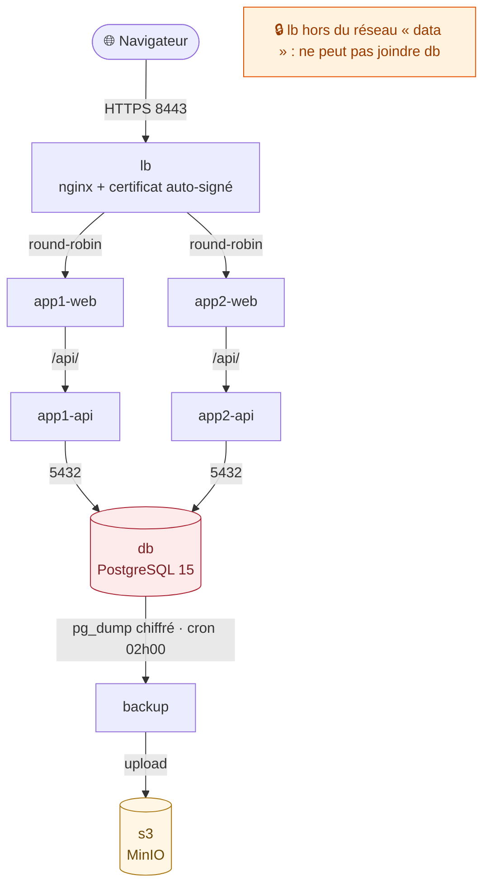

# 🏄 Démo locale Shaka Surf — l'architecture AWS sur votre poste

Cette démo reproduit **à l'identique, en local**, l'architecture que Terraform
et Ansible déploient sur AWS : un load balancer TLS, **deux** VMs applicatives,
une base PostgreSQL isolée, un bucket S3 (MinIO) et la chaîne de sauvegarde
chiffrée. Un seul prérequis : **Docker** (Desktop ou Engine + plugin compose).



Les **réseaux Docker simulent les Security Groups AWS** : le load balancer
n'est pas sur le réseau `data`, il est donc *physiquement* incapable de joindre
la base de données — exactement comme l'exige le sujet. Seuls trois ports
sortent du bocal : `8080` (HTTP → 301), `8443` (HTTPS) et `9001` (console MinIO).

| Service Docker        | Équivalent AWS                              |
|-----------------------|---------------------------------------------|
| `lb`                  | VM Load Balancer (Nginx + TLS)              |
| `app1-web`/`app1-api` | VM App 1 (frontend + backend)               |
| `app2-web`/`app2-api` | VM App 2 (frontend + backend)               |
| `db`                  | VM Base de données (PostgreSQL 15)          |
| `backup`              | Cron pg_dump chiffré de la VM db            |
| `s3`                  | Bucket S3 (versioning des sauvegardes)      |

> 🔑 Tous les mots de passe de cette démo (`demo`, `demodemo123`,
> `demo-passphrase`) sont volontairement évidents : **démo locale uniquement**.
> En production, ils vivent dans Ansible Vault et l'accès S3 passe par IAM.

---

## 🚀 1. Tout démarrer (une seule commande)

Depuis la **racine du dépôt** :

```bash
docker compose up --build -d
```

Premier lancement : comptez 1 à 2 minutes (builds + init de la base).
Vérifiez que tout est vert :

```bash
docker compose ps
```

---

## 🌊 2. Le parcours de démo, pas à pas

### Étape 1 — HTTPS et redirection

Ouvrez <http://localhost:8080> : vous êtes **redirigé en 301** vers
<https://localhost:8443>. Le certificat est auto-signé (CN=localhost), le
navigateur affiche donc un avertissement : cliquez sur *Avancé → Continuer*.
C'est attendu — en prod, c'est Let's Encrypt qui signe.

### Étape 2 — Round-robin du load balancer 🔁

Sur la page, cliquez sur le bouton **« 10 requêtes »** : les réponses
alternent entre `app-1` et `app-2`. C'est le round-robin Nginx qui répartit la
charge entre les deux VMs applicatives, comme dans l'architecture du sujet.

### Étape 3 — Réservation persistée 📝

Réservez un spot (Hossegor, Nazaré 🌊...) via le formulaire, puis rechargez la
page : la réservation est toujours là. Elle est stockée dans PostgreSQL, sur la
"VM" base de données — pas dans le conteneur applicatif.

### Étape 4 — Panne de la base de données 🔥

```bash
docker compose stop db
```

Rechargez la page : l'application **ne crashe pas**, elle affiche un **bandeau
mode dégradé** (l'API répond `db: "down"`). Puis tout remettre d'aplomb :

```bash
docker compose start db
```

### Étape 5 — Sauvegarde chiffrée vers S3 💾

Le cron tourne chaque nuit à 02h00 ; pour ne pas attendre, déclenchez-la à la
main :

```bash
docker compose exec backup backup
```

Le script enchaîne `pg_dump → gzip → chiffrement AES-256 → envoi S3`, puis
purge le fichier local (la rétention vit côté S3, comme en prod).

### Étape 6 — La preuve dans la console MinIO 🪣

Ouvrez <http://localhost:9001> et connectez-vous avec
**`demo` / `demodemo123`** (démo locale uniquement). Dans le bucket
`shaka-surf-backups`, préfixe `postgres/`, vous voyez l'objet
`AAAA-MM-JJ_HHMMSS.sql.gz.enc` — chiffré, donc illisible même si le bucket
fuyait.

### Étape 7 — Restauration 🔄

Pour prouver que la sauvegarde n'est pas décorative :

1. ajoutez une **nouvelle** réservation *après* la sauvegarde de l'étape 5 ;
2. restaurez la sauvegarde la plus récente :

   ```bash
   docker compose exec backup restore
   ```

3. rechargez la page : la réservation post-sauvegarde a disparu, la base est
   revenue **exactement** à l'état sauvegardé.

---

## 🧹 3. Tout nettoyer

```bash
docker compose down -v
```

Le `-v` supprime aussi les volumes (`pgdata`, `minio-data`) : données et
sauvegardes incluses, le poste est rendu propre.

---

## 🧭 Aide-mémoire

| Quoi                      | Où / Comment                                   |
|---------------------------|------------------------------------------------|
| Application (HTTPS)       | <https://localhost:8443>                       |
| Redirection HTTP → HTTPS  | <http://localhost:8080>                        |
| Console MinIO             | <http://localhost:9001> (`demo`/`demodemo123`) |
| Sauvegarde manuelle       | `docker compose exec backup backup`            |
| Restauration              | `docker compose exec backup restore`           |
| Simuler une panne DB      | `docker compose stop db` (puis `start db`)     |
| Logs d'un service         | `docker compose logs -f lb` (ou `db`, `backup`…) |
| État des services         | `docker compose ps`                            |
| Tout arrêter et nettoyer  | `docker compose down -v`                       |

Bonne session 🤙
