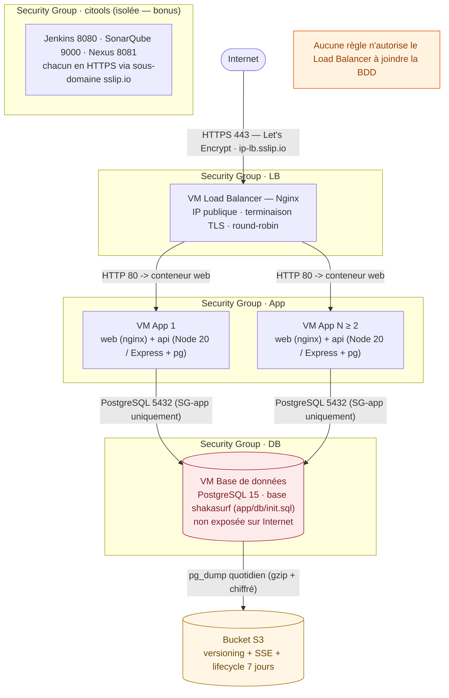

# Architecture

## Vue d'ensemble

## Application sur chaque VM App (mock)

L'application réelle est remplacée par un **mock versionné dans le dépôt**
(`app/`) — le sujet laisse les technologies applicatives libres. Chaque VM App
exécute deux conteneurs via `docker compose` (`app/docker-compose.yml`, copié
par le rôle Ansible `app` dans `/opt/shaka-surf`) :

| Conteneur | Image / techno | Port | Rôle |
|-----------|--------------------|-----------------|------|
| `web` | nginx:alpine | 80 (depuis LB) | Sert le frontend statique (`app/frontend/`) et proxifie `/api/` vers l'API |
| `api` | Node 20 (Express + pg) | 9940 (interne) | API métier (`/api/whoami`, `/api/health`, `/api/dashboard`, `/api/lessons`, `/api/enrollments`), connectée à PostgreSQL sur la VM DB |

Le load balancer ne parle qu'au port 80 (`web`) des VMs App ; seul le conteneur
`api` connaît la base de données. Le schéma et le seed (`app/db/init.sql`) sont
idempotents et appliqués par le rôle `database`.

## Machines et rôles Ansible

| Hôte (groupe inventaire) | Rôles appliqués | Ports exposés |
|--------------------------|-------------------------------------|---------------|
| `loadbalancer` | common, loadbalancer | 22, 80, 443 |
| `app` (×N≥2) | common, app | 22, 80 (depuis LB) |
| `db` | common, database, backup | 22, 5432 (depuis App) |
| `citools` | common, jenkins, sonarqube, nexus | 22, 443, 8080, 9000, 8081 |

## Flux réseau / Security Groups

| Security Group | Entrant autorisé | But |
|----------------|--------------------------------------------------------|-----|
| `sg-lb` | 80, 443 depuis `0.0.0.0/0` ; 22 depuis `admin_cidr` | Point d'entrée HTTPS unique |
| `sg-app` | 80 depuis `sg-lb` uniquement ; 22 depuis `admin_cidr` | App joignable seulement via le LB |
| `sg-db` | 5432 depuis `sg-app` uniquement ; 22 depuis `admin_cidr` | DB non exposée à Internet |
| `sg-citools` | 8080/9000/8081/443 + 22 depuis `admin_cidr` | Usine logicielle isolée |

> **Important :** aucune règle n'autorise le Load Balancer à joindre la VM Base de
> données — le LB ne connaît pas la BDD (exigence du sujet, conseil §6).

## Démo locale <-> AWS

Le `docker-compose.yml` à la racine du dépôt reproduit toute cette architecture
sur un seul poste (sans compte AWS) :

| Démo locale (compose racine) | Production AWS |
|-----------------------------------------------|----------------|
| `lb` (`demo/lb/` — nginx + cert auto-signé) | VM Load Balancer (nginx + Let's Encrypt) |
| `app1-web`/`app1-api`, `app2-web`/`app2-api` | VMs App (conteneurs `web` + `api` sur chaque VM) |
| `db` (postgres:15-alpine) | VM Base de données (PostgreSQL 15) |
| `s3` (MinIO) | Bucket S3 AWS |
| Réseaux compose (`edge`, `app1`, `app2`, `data`, `storage`) | Security Groups |
| Conteneur `backup` (`demo/backup/` — cron 02:00) | Cron de la VM DB (rôle `backup`) |

La règle de sécurité clé est rejouée à l'identique : le conteneur `lb` n'est
**pas** membre du réseau `data`, il ne peut donc pas joindre la base de données.

## Composants

- **Terraform** (`terraform/`) : VPC + subnets, Security Groups, EC2 (LB/App/DB/citools),
  bucket S3, rôle IAM (instance-profile) pour les backups, outputs -> inventaire Ansible.
- **Ansible** (`ansible/`) : rôles + inventaire par groupes, secrets via Ansible Vault
  (3 valeurs : `vault_postgres_password`, `vault_postgres_admin_password`,
  `vault_backup_passphrase`),
  playbooks `site.yml` (déploiement) et `restore.yml` (restauration S3 indépendante).
- **Molecule** : un scénario par rôle (driver Docker), vérifie service actif + ports
  (ou le rendu des fichiers pour les rôles trop lourds à booter en conteneur).
- **App mock** (`app/`) : frontend statique + API Express + `init.sql`, construits
  sur chaque VM App par `docker compose`.
- **Démo locale** (`docker-compose.yml` racine + `demo/`) : la même architecture
  en conteneurs, pour tester sans AWS.
